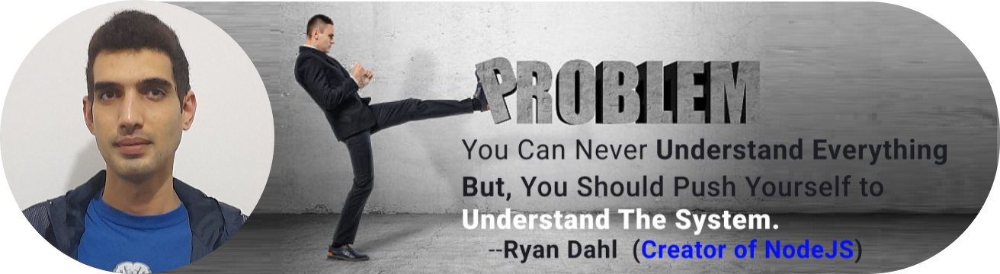
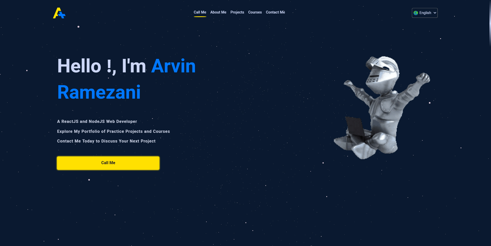
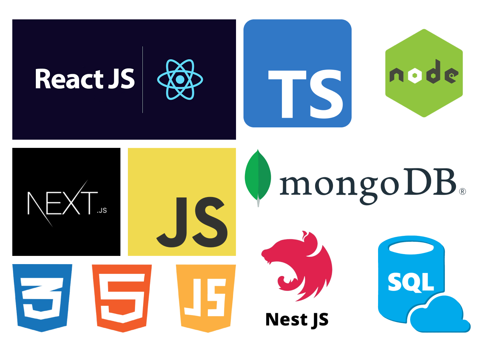
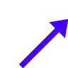
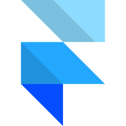
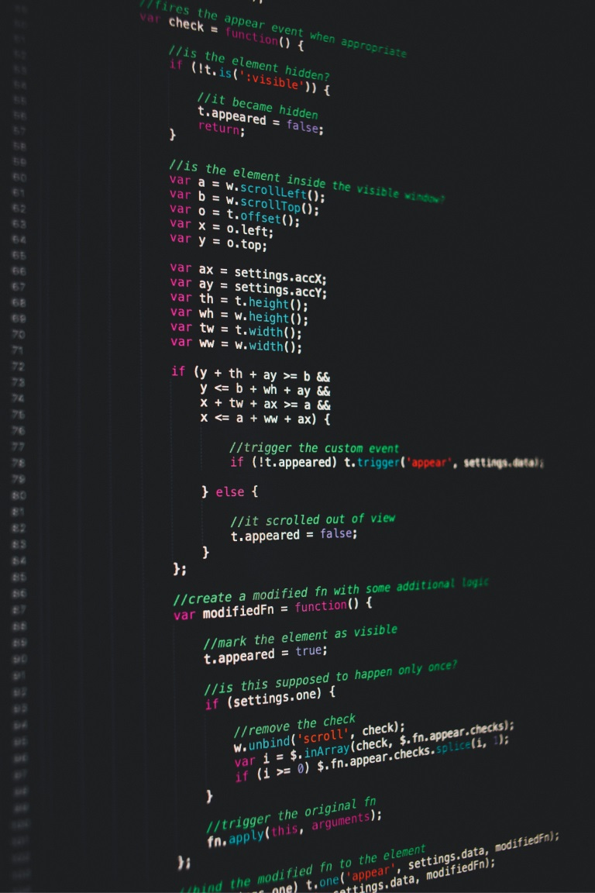

  

  

<ul>
 <li>
    💻 Hey there, I'm <b>Arvin Ramezani</b>, a <b>self-taught ReactJS and NodeJS Web Developer</b>. Over the past three years, I started learning the ins and outs of web development through <b>Persian online courses</b>, and then continued my education on <b>Udemy</b> with a focus on courses offered by <b><a href="https://pro.academind.com" target="_blank">Academind</a></b> Company.</li>
  <li>
    
    I believe in <b>continuous learning</b> and <b>staying up-to-date</b> with the latest skills and tech tools, and my current areas of focus is <b>Automated Testing with Jest / Vitest and Cypress</b>.
  </li>
  <li>
  
   If you're interested in working with me, feel free to <b>download my resume</b> and get in touch. I'm always happy to chat about potential collaborations and new opportunities.
  </li>
   
  <a href="https://imarvin.ir/#about" target="_blank">Get In Touch &<b> Download Resume</b>
  
  </a>
</ul>
 

<table align="center" height="500px">
  <tr>
    <td align="center">
      <a href="https://pt-br.reactjs.org/">
         
        
          <b>
            <pre>React.js</pre>
          </b>
        
      </a>
    </td>
    <td align="center">
      <a href="https://nextjs.org/">
         
        
          <b>
            <pre>Next.js</pre>
          </b>
        
      </a>
    </td>
    <td align="center">
      <a href="https://nodejs.org/">
         
        
          <b>
            <pre>Nodejs</pre>
          </b>
        
      </a>
    </td>
    <td align="center">
      <a href="https://www.typescriptlang.org/">
         
        
          <b>
            <pre>Typescript</pre>
          </b>
        
      </a>
    </td>
    <td align="center">
      <a href="https://https://nestjs.com/">
         
        
          <b>
            <pre>NestJS</pre>
          </b>
        
      </a>
    </td>
  </tr>
  <tr>
     <td align="center">
      <a href="https://www.mongodb.com/">
         
        
          <b>
            <pre>MongoDB</pre>
          </b>
        
      </a>
    </td>
       <td align="center">
      <a href="https://www.postgresql.org/">
       
      
        <b>
          <pre>PostgreSQl</pre>
        </b>
      
      </a>
    </td>
    <td align="center">
      <a href="https://docker.com/">
         
        
          <b>
            <pre>Docker</pre>
          </b>
        
      </a>
    </td>
    <td align="center">
      <a href="https://kubernetes.io/">
         
        
          <b>
            <pre>Kubernetes</pre>
          </b>
        
      </a>
    </td>
    <td align="center">
      <a href="https://git-scm.com/">
         
        
          <b>
            <pre>Git & GitHub</pre>
          </b>
        
      </a>
    </td>
  </tr>
  <tr>
    <td align="center">
      <a href="https://www.styled-components.com/">
       
      
        <b>
          <pre>Styled Components CSS</pre>
        </b>
      
      </a>
    </td>
    <td align="center">
      <a href="https://www.framer.com/motion/">
         
        
          <b>
            <pre>Framer Motion</pre>
          </b>
        
      </a>
    </td>
    <td align="center">
      <a href="https://mui.com/">
         
        
          <b>
            <pre>Material UI</pre>
          </b>
        
      </a>
    </td>
    <td align="center">
      <a href="https://getbootstrap.com/">
       
      
        <b>
          <pre>Bootstrap</pre>
        </b>
      
      </a>
    </td>
    <td align="center">
      <a href="https://tailwindcss.com/">
         
        
          <b>
            <pre>Tailwind</pre>
          </b>
        
      </a>
    </td>
  </tr>
  <tr>
     <td align="center">
      <a href="https://next-auth.js.org/">
         
        
          <b>
            <pre>NextAuth</pre>
          </b>
        
      </a>
    </td>
    <td align="center">
      <a href="https://react-hook-form.com/">
         
        
          <b>
            <pre>React Hook Form</pre>
          </b>
        
      </a>
    </td>
     <td align="center">
      <a href="https://redux-toolkit.js.org/">
         
        
          <b>
            <pre>Redux Toolkit</pre>
          </b>
        
      </a>
    </td>
    <td align="center">
      <a href="https://graphql.org/">
         
        
          <b>
            <pre>GraphQL</pre>
          </b>
       </a>
      
    </td>
    <td align="center">
      <a href="https://expressjs.com/">
         
        
          <b>
            <pre>Express.js</pre>
          </b>
        
      </a>
    </td>
  </tr>
  <tr>
    <td align="center">
      <a href="https://openai.com/">
       
      
        <b>
          <pre>Chatgpt</pre>
        </b>
      
      </a>
    </td>
    <td align="center">
      <a href="https://developer.mozilla.org/en-US/docs/Web/JavaScript/">
         
        
          <b>
            <pre>Javascript</pre>
          </b>
        
      </a>
    </td>
    <td align="center">
      <a href="https://developer.mozilla.org/en-US/docs/Web/CSS/">
         
        
          <b>
            <pre>CSS3</pre>
          </b>
        
      </a>
    </td>
    <td align="center">
      <a href="https://developer.mozilla.org/en-US/docs/Web/HTML/">
         
        
          <b>
            <pre>HTML5</pre>
          </b>
        
      </a>
    </td>
  </tr>
</table>
 

  

  <a href="mailto:arvin.ramezani6@gmail.com" target="_blank">
    
    &nbsp;
  </a>
  <a href="https://www.linkedin.com/in/arvin-ramezani/" target="_blank">
    
    &nbsp;
  </a>
  <a href="https://t.me/arvinrmz" target="_blank">
    
    &nbsp;
  </a>
  <a href="https://wa.me/+989361599686" target="_blank">
    
    &nbsp;
  </a>
  <a href="https://www.instagram.com/arvin.webdev/" target="_blank">
    
    &nbsp;
  </a>

 

<table height="500px" align="right">
  <tr>
   <td>
      
       
      <table>
        <tr>
          <td>
            <a href="https://github.com/arvin-ramezani/portfolio" target="_blank">
              Repository
            </a>
          </td>
          <td>
            <a href="https://imarvin.ir/#projects" target="_blank">
              See On <b>Portfolio</b>
            </a>
          </td>
        </tr>
      </table>
    </td>
  </tr>
  <tr>
    <td>
      
       
      <table>
        <tr>
          <td>
            <a href="https://github.com/arvin-ramezani/MERN-animals-house" target="_blank">
              Repository
            </a>
          </td>
          <td>
            <a href="https://imarvin.ir/#projects" target="_blank">
              See On <b>Portfolio</b>
            </a>
          </td>
        </tr>
      </table>
    </td>
  </tr>
  <tr>
    <td>
      
       
      <table>
        <tr>
          <td>
            <a href="https://github.com/arvin-ramezani/MERN-simple-watch-shop" target="_blank">
              Repository
            </a>
          </td>
          <td>
            <a href="https://imarvin.ir/#projects" target="_blank">
              See On <b>Portfolio</b>
            </a>
          </td>
        </tr>
      </table>
    </td>
  </tr>
  <tr>
    <td>
      
       
      <table>
        <tr>
          <td>
            <a href="https://github.com/arvin-ramezani/pizza-shop" target="_blank">
              Repository
            </a>
          </td>
          <td>
            <a href="https://imarvin.ir/#projects" target="_blank">
              See On <b>Portfolio</b>
            </a>
          </td>
        </tr>
      </table>
    </td>
  </tr>
  <tr>
   <td>
      
       
      <table>
        <tr>
          <td>
            <a href="https://github.com/arvin-ramezani/nest.js-realtor-app" target="_blank">
              Repository
            </a>
          </td>
          <td>
            <a href="https://imarvin.ir/#projects" target="_blank">
              See On <b>Portfolio</b>
            </a>
          </td>
        </tr>
      </table>
    </td>
  </tr>
  <tr>
   <td>
      
       
      <table>
        <tr>
          <td>
            <a href="https://github.com/arvin-ramezani/nestjs-authentication" target="_blank">
              Repository
            </a>
          </td>
        </tr>
      </table>
    </td>
  </tr>
  <tr>
    <td>
      
       
      <table>
        <tr>
          <td>
            <a href="https://github.com/arvin-ramezani/NestJs-TypeOrm-graphql" target="_blank">
              Repository
            </a>
          </td>
        </tr>
      </table>
    </td>
  </tr>
  <tr>
    <td>
      
       
      <table>
        <tr>
          <td>
            <a href="https://github.com/arvin-ramezani/nestjs-rabbitmq" target="_blank">
              Repository
            </a>
          </td>
        </tr>
      </table>
    </td>
  </tr>
  <tr>
    <td>
      
       
      <table>
        <tr>
          <td>
            <a href="https://github.com/arvin-ramezani/nestjs-graphql" target="_blank">
              Repository
            </a>
          </td>
        </tr>
      </table>
    </td>
  </tr>
  <tr>
    <td>
      
       
      <table>
        <tr>
          <td>
            <a href="https://github.com/arvin-ramezani/gRPC-node-tutorial" target="_blank">
              Repository
            </a>
          </td>
        </tr>
      </table>
    </td>
  </tr>
  <tr>
    <td>
      
       
      <table>
        <tr>
          <td>
            <a href="https://github.com/arvin-ramezani/nest-socket.io" target="_blank">
              Repository
            </a>
          </td>
        </tr>
      </table>
    </td>
  </tr>
   <tr>
    <td>
      
       
      <table>
        <tr>
          <td>
            <a href="https://github.com/arvin-ramezani/nestjs-mongodb-repository" target="_blank">
              Repository
            </a>
          </td>
        </tr>
      </table>
    </td>
  </tr>
  <tr>
    <td>
      
       
      <table>
        <tr>
          <td>
            <a href="https://github.com/arvin-ramezani/express-typeOrm" target="_blank">
              Repository
            </a>
          </td>
        </tr>
      </table>
    </td>
  </tr>
  <tr>
    <td>
      
       
      <table>
        <tr>
          <td>
            <a href="https://github.com/arvin-ramezani/express-typeorm-cli" target="_blank">
              Repository
            </a>
          </td>
        </tr>
      </table>
    </td>
  </tr>
  <tr>
    <td>
      
       
      <table>
        <tr>
          <td>
            <a href="https://github.com/arvin-ramezani/NestJs-Postgresql-Task_Manager-API" target="_blank">
              Repository
            </a>
          </td>
        </tr>
      </table>
    </td>
  </tr>
  <tr>
    <td>
      
       
      <table>
        <tr>
          <td>
            <a href="https://github.com/arvin-ramezani/MERN-stack-blog" target="_blank">
              Repository
            </a>
          </td>
        </tr>
      </table>
    </td>
  </tr>
  <tr>
    <td>
      
       
      <table>
        <tr>
          <td>
            <a href="https://github.com/arvin-ramezani/jobinja-jobs" target="_blank">
              Repository
            </a>
          </td>
        </tr>
      </table>
    </td>
  </tr>
  <tr>
    <td>
      
       
      <table>
        <tr>
          <td>
            <a href="https://github.com/arvin-ramezani/Random-user-vue.3" target="_blank">
              Repository
            </a>
          </td>
        </tr>
      </table>
    </td>
  </tr>
  <tr>
    <td>
      
       
      <table>
        <tr>
          <td>
            <a href="https://github.com/arvin-ramezani/shopping-cart" target="_blank">
              Repository
            </a>
          </td>
        </tr>
      </table>
    </td>
  </tr>
</table>
                      

  
  

