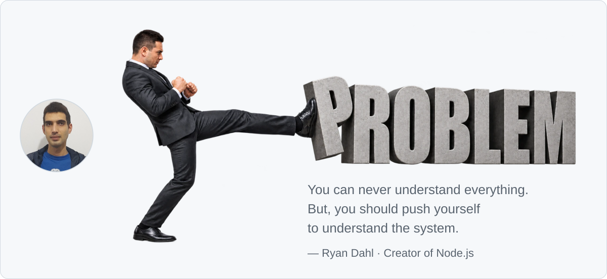

# Arvin Ramezani

**Full-stack developer**

I build web products and developer tools with TypeScript, React, Node.js, and PostgreSQL.

[Explore my work](#selected-work) · [Repository guide](./REPOSITORIES.md)

##  Selected work

### [imarvin](https://github.com/arvin-ramezani/imarvin)

A personal web app for exploring projects through their problems, decisions, and evidence, with private editing and deliberate publishing.

In development · Next.js, React, PostgreSQL, Prisma

[Product brief](https://github.com/arvin-ramezani/imarvin/blob/main/PRD.md) · [Architecture](https://github.com/arvin-ramezani/imarvin/blob/main/docs/architecture/architecture.md) · [Implementation](https://github.com/arvin-ramezani/imarvin/tree/main/features)

### [Unixsee](https://github.com/arvin-ramezani/unixsee-monorepo)

Managed infrastructure and monitoring for WordPress and WooCommerce: customer and admin apps, a backend control plane, and a Linux monitoring agent.

In development · Next.js, NestJS, PostgreSQL, Prisma, Node.js

[System overview](https://github.com/arvin-ramezani/unixsee-monorepo/blob/main/docs/architecture/overview.md) · [Backend](https://github.com/arvin-ramezani/unixsee-monorepo/tree/main/backend/src) · [Monitoring agent](https://github.com/arvin-ramezani/unixsee-monorepo/blob/main/agent/README.md)

### [ai-skills](https://github.com/arvin-ramezani/ai-skills)

Reusable AI-agent skills for architecture decisions, documentation, product design, React, and testing, with portable installation and packaging scripts.

Skill library · Markdown, Python

[Skill catalog](https://github.com/arvin-ramezani/ai-skills#skills) · [Architecture advisor](https://github.com/arvin-ramezani/ai-skills/tree/main/skills/software-architecture-advisor) · [Test engineering](https://github.com/arvin-ramezani/ai-skills/tree/main/skills/test-engineering)

### [CI See](https://github.com/arvin-ramezani/ci-see)

A planned CLI for running existing GitHub Actions locally through `act` and gating commits and pushes against the validated Git state.

Planning & specifications · TypeScript/Node.js architecture

[Requirements](https://github.com/arvin-ramezani/ci-see/blob/main/docs/prd.md) · [Architecture](https://github.com/arvin-ramezani/ci-see/blob/main/docs/architecture.md) · [Git gating spec](https://github.com/arvin-ramezani/ci-see/blob/main/docs/specs/git-gating.md)

##  How I work

I turn requirements into architecture decisions and tested implementation. I use AI agents to support that process, with explicit scope, source-based reviews, and checks on important behavior.

I'm interested in software architecture and product design, and I'm currently learning Go.

My public work includes [spec-driven delivery](https://github.com/arvin-ramezani/imarvin/blob/main/docs/engineering/spec-driven-development.md), [architecture decisions](https://github.com/arvin-ramezani/unixsee-monorepo/tree/main/docs/architecture/decisions), and [API regression tests](https://github.com/arvin-ramezani/simple-nodejs-crud-api/tree/master/src/routes/__test__).

##  Technical focus

- **Frontend:** TypeScript, React, Next.js, Tailwind CSS
- **Backend:** Node.js, NestJS
- **Data:** PostgreSQL, Prisma
- **Quality & delivery:** Vitest, Playwright, Docker, GitHub Actions

## Explore further

[Browse the public repository guide](./REPOSITORIES.md) for application studies, backend experiments, interface work, and references. Each entry includes useful files to inspect; forks and planning work are labeled.

For tools that read structured data: [repository index (JSON)](./projects.json).

##  Get in touch

[LinkedIn](https://www.linkedin.com/in/arvin-ramezani/) · [Email](mailto:arvin.ramezani6@gmail.com)
