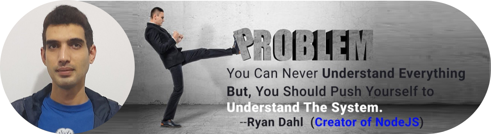

# Arvin Ramezani

Full-stack developer building web products and developer tools with TypeScript, React, Next.js, Node.js, and PostgreSQL.

Interested in software architecture, product design, and AI agents.

##  Selected work

### [imarvin](https://github.com/arvin-ramezani/imarvin) — In development
A personal app for presenting work as evidence-led stories.

### [ci-see](https://github.com/arvin-ramezani/ci-see) — In development
A local-first GitHub Actions runner with developer-controlled commit and push gating.

### [ai-skills](https://github.com/arvin-ramezani/ai-skills)
Reusable AI-agent skills for architecture, documentation, product design, React, and testing.

##  How I work

I turn requirements into architecture decisions and tested implementation.

##  Technical focus

- **Frontend:** TypeScript, React, Next.js, Tailwind CSS
- **Backend:** Node.js, NestJS
- **Data:** PostgreSQL, Prisma
- **Delivery:** Docker, CI, automated testing
- **Currently exploring:** Go

##  Get in touch

[LinkedIn](https://www.linkedin.com/in/arvin-ramezani/) · [Email](mailto:arvin.ramezani6@gmail.com)
